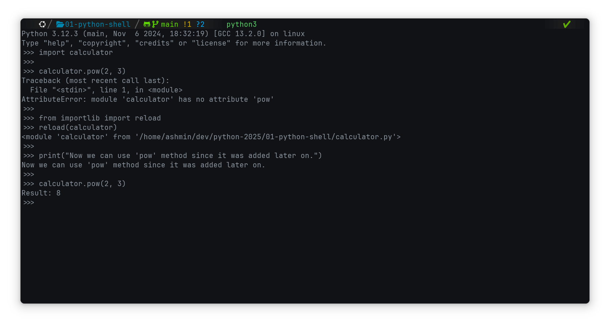

# Python Shell

- [x] Open Python shell or IDLE
      
- [x] Import functions from "calculator.py" file and use it inside python shell
      
- [x] We can import "reload" method from importlib to reload our modules without closing the shell
      
